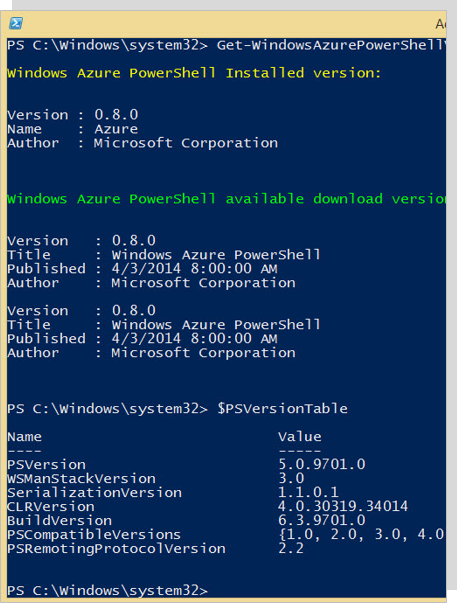
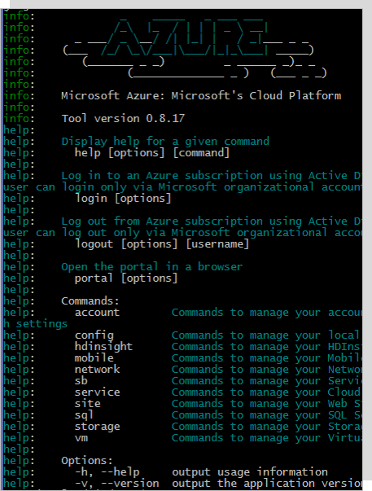
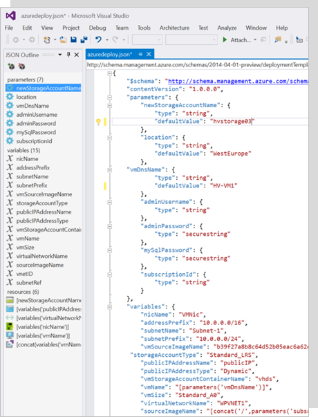

###### Go back to [IaaS Fundamentals](iaas-fundamentals.md#resources)

# Azure Resource Manager

## What is Azure Resource Manager (ARM)?

* [Azure Resource Manager overview](https://docs.microsoft.com/en-us/azure/azure-resource-manager/resource-group-overview) 
* [Terminology](https://docs.microsoft.com/en-us/azure/azure-resource-manager/resource-group-overview#terminology)
* [The benefits of using Resource Manager](https://docs.microsoft.com/en-us/azure/azure-resource-manager/resource-group-overview#the-benefits-of-using-resource-manager)

## Resource group

* [Resource Groups](https://docs.microsoft.com/en-us/azure/azure-resource-manager/resource-group-overview#resource-groups) 
* [Move resources to new resource group or subscription](https://docs.microsoft.com/en-us/azure/azure-resource-manager/resource-group-move-resources)

## Walkthrough: Resources in Azure (Resource Explorer)

* Open the **Azure Portal** https://portal.azure.com.
* On the Search option (top bar) type **Resource Explorer**.
* Pick/expand one of your subscriptions and then Resource Groups.
* Pick/expand one of your resource groups and expand Resources.
* You’ll find all of the Azure resources created in this Resource Group.
* Click in one of the resources and click Open blade (right window) to see the management experience of that resource.

## Deployment and management tools

| Azure Portal  | Azure PowerShell | Azure CLI  | Azure Rest API | ARM Template |
| ------------- | ------------- | ------------- |------------- | ------------- |
|  |  |  |  |  |

More resources:
* [Azure PowerShell](https://docs.microsoft.com/en-us/powershell/azure)
* [Azure CLI](https://docs.microsoft.com/en-us/cli/azure/overview)
* [Azure Rest API](https://docs.microsoft.com/en-us/rest/api/)
* [ARM Template](https://docs.microsoft.com/en-us/azure/azure-resource-manager/resource-group-overview#template-deployment)

## ARM templates

* [ARM Template](https://docs.microsoft.com/en-us/azure/azure-resource-manager/resource-group-overview#template-deployment)

* [Azure Quickstart Templates](https://azure.microsoft.com/en-us/resources/templates/)

* [Export an Azure Resource Manager template from existing resources](https://docs.microsoft.com/en-us/azure/azure-resource-manager/resource-manager-export-template)

## Walkthrough: Azure Templates (Azure Docs and GitHub)

* Open **Azure website** https://azure.microsoft.com/en-us/ 
* On the top menu click on **Resources**.
* On the Azure resources page click on **Templates**.
* You should see the **Azure Quickstart Templates** page/gallery.
* Let’s search, for example, for one template regarding virtual networks.
* Type vnet on the search box and click Enter.
* Pick one example and click on the title to open the template to see the details.
* Show the template details (input parameters, how to deploy the template using PowerShell or Command Line Interface).
* All the templates are stored on GitHub. To go to the template on GitHub, click on **Browse on GitHub** option (use right-click and open in a new tab option).
* On the GitHub Page, click on the .json file to see the actual content of the template.
* Go back to the template page on the Azure site and click on **Deploy to Azure**, to show how to directly deploy the template from here to the Azure portal.
* To deploy the template, we’ll be prompt to add all the input values for the input parameters defined on the template (such as, the name of the Resource Group, name of the Virtual Network, etc.).

###### Go back to [IaaS Fundamentals](iaas-fundamentals.md#resources)