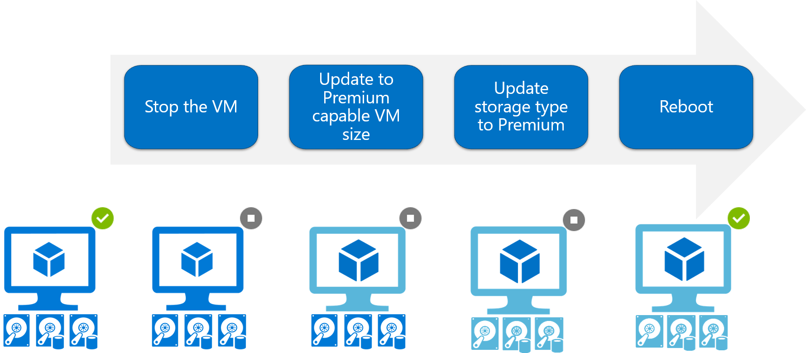
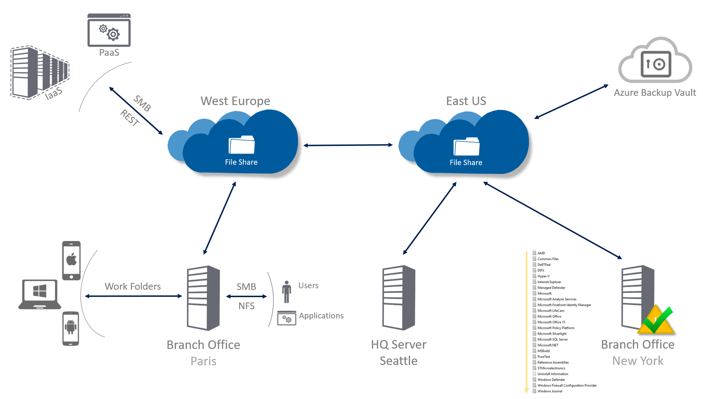

###### Go back to [IaaS Fundamentals](iaas-fundamentals.md#resources)

# Azure Storage

## What is Azure Storage?

* [Azure Storage](https://docs.microsoft.com/en-us/azure/storage/)
* [Introduction to Microsoft Azure Storage](https://docs.microsoft.com/en-us/azure/storage/common/storage-introduction)
* [Introducing the Azure Storage services](https://docs.microsoft.com/en-us/azure/storage/common/storage-introduction#introducing-the-azure-storage-services)

## Types of storage accounts

* [Types of storage accounts](https://docs.microsoft.com/en-us/azure/storage/common/storage-introduction#types-of-storage-accounts)
  * General-purpose Standard	
  * General-purpose Premium	
  * Blob storage, hot and cool access tiers

## Scenarios

* [Deciding when to use Azure Blobs, Azure Files, or Azure Disks](https://docs.microsoft.com/en-us/azure/storage/common/storage-decide-blobs-files-disks)

## Walkthrough: Create a Storage Account

> **GUIDE** [Create a storage account](https://docs.microsoft.com/en-us/azure/storage/storage-create-storage-account#create-a-storage-account)

> **GUIDE** [Manage your storage account](https://docs.microsoft.com/en-us/azure/storage/storage-create-storage-account#manage-your-storage-account)

## Disks

### Disks for Azure VMs

* [About disks storage for Azure Windows VMs](https://docs.microsoft.com/en-us/azure/virtual-machines/windows/about-disks-and-vhds)
* [Disks used by VMs](https://docs.microsoft.com/en-us/azure/virtual-machines/windows/about-disks-and-vhds#disks-used-by-vms)
  * Operating system disk
  * Temporary disk
  * Data disk
* [About VHDs](https://docs.microsoft.com/en-us/azure/virtual-machines/windows/about-disks-and-vhds#about-vhds)
* [Types of disks](https://docs.microsoft.com/en-us/azure/virtual-machines/windows/about-disks-and-vhds#types-of-disks) 
  * Performance tiers: Standard or Premium Storage
  * Types of disks: unmanaged or managed

### Managed Disks

* [Azure Managed Disks Overview](https://docs.microsoft.com/en-us/azure/virtual-machines/windows/managed-disks-overview)
* [Benefits of managed disks](https://docs.microsoft.com/en-us/azure/virtual-machines/windows/managed-disks-overview#benefits-of-managed-disks)
* [Pricing and Billing](https://docs.microsoft.com/en-us/azure/virtual-machines/windows/managed-disks-overview#pricing-and-billing)
* [Managed Disk Snapshots](https://docs.microsoft.com/en-us/azure/virtual-machines/windows/managed-disks-overview#managed-disk-snapshots)
* [Images](https://docs.microsoft.com/en-us/azure/virtual-machines/windows/managed-disks-overview#images)
* [Images versus snapshots](https://docs.microsoft.com/en-us/azure/virtual-machines/windows/managed-disks-overview#images-versus-snapshots)
* [Managed Disks and Encryption](https://docs.microsoft.com/en-us/azure/virtual-machines/windows/managed-disks-overview#managed-disks-and-encryption)

## Walkthrough: Create a VM with Managed Disks

> **GUIDE** [Create a Windows virtual machine with the Azure portal](https://docs.microsoft.com/en-us/azure/virtual-machines/windows/quick-create-portal)

## Walkthrough: Convert Managed Disk from standard to premium, and vice versa

* Managed disks offers two storage options: Premium (SSD-based) and Standard (HDD-based).
* It allows you to easily switch between the two options with minimal downtime based on your performance needs. 
* The conversion requires a restart of the VM, so schedule the migration of your disks storage during a pre-existing maintenance window.

> **GUIDE** [Convert Azure managed disks storage from standard to premium, and vice versa](https://docs.microsoft.com/en-us/azure/virtual-machines/windows/convert-disk-storage)

## Files

* [Introduction to Azure Files](https://docs.microsoft.com/en-us/azure/storage/files/storage-files-introduction)
* [Why Azure Files is useful](https://docs.microsoft.com/en-us/azure/storage/files/storage-files-introduction#why-azure-files-is-useful)
* [Key benefits](https://docs.microsoft.com/en-us/azure/storage/files/storage-files-introduction#key-benefits)
* [FAQ](https://docs.microsoft.com/en-us/azure/storage/files/storage-files-faq)

## Walkthrough: Create a File Share

> **GUIDE** [Create a storage account](https://docs.microsoft.com/en-us/azure/storage/common/storage-create-storage-account#create-a-storage-account)

> **GUIDE** [Create a file share](https://docs.microsoft.com/en-us/azure/storage/files/storage-how-to-use-files-portal#create-file-share)

> **GUIDE** [Upload and download files](https://docs.microsoft.com/en-us/azure/storage/files/storage-how-to-use-files-portal#upload-and-download-files)

> **GUIDE** [Connect to file share](https://docs.microsoft.com/en-us/azure/storage/files/storage-how-to-use-files-portal#connect-to-file-share)

###### Go back to [IaaS Fundamentals](iaas-fundamentals.md#resources)
