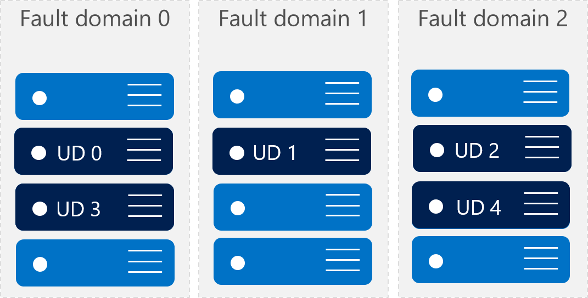
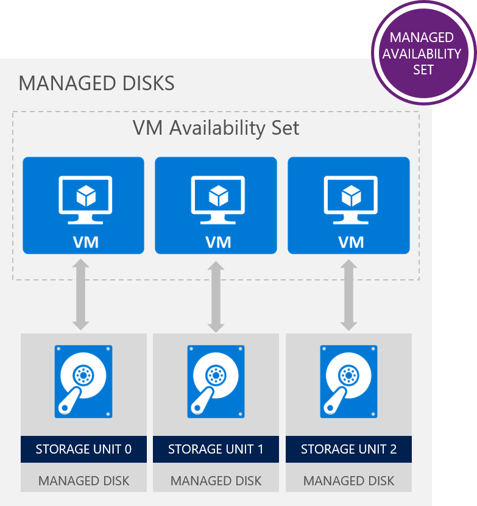

# IaaS Fundamentals - Reference Resources

* [Azure Public Website](https://azure.microsoft.com)
* [Azure Portal](https://portal.azure.com)

## Azure Planned Maintenance

* [Official Azure blog post on vulnerability and our maintenance](https://azure.microsoft.com/en-us/blog/securing-azure-customers-from-cpu-vulnerability/)

* [Azure documentation page with Frequently Asked Questions](https://docs.microsoft.com/en-us/azure/virtual-machines/windows/accelerated-maintenance)

* [Guidance for mitigating speculative execution side-channel vulnerabilities](https://docs.microsoft.com/en-us/azure/virtual-machines/windows/mitigate-se)
​
* [Security TechCenter Advisory: Guidance for Windows​](https://portal.msrc.microsoft.com/en-US/security-guidance/advisory/ADV180002)
​

## Azure Overview

* [What is cloud computing?](https://azure.microsoft.com/en-us/overview/what-is-cloud-computing/)

* Types of cloud services: [IaaS](https://azure.microsoft.com/en-us/overview/what-is-iaas/), [PaaS](https://azure.microsoft.com/en-us/overview/what-is-paas/), [SaaS](https://azure.microsoft.com/en-us/overview/what-is-saas/)
* [What is Azure?](https://azure.microsoft.com/en-us/overview/what-is-azure/) 
* Azure main pillars
  * [Productive](https://azure.microsoft.com/en-us/overview/productivity/)
  * [Hybrid](https://azure.microsoft.com/en-us/overview/hybrid-cloud/)
  * [Intelligent](https://azure.microsoft.com/en-us/overview/intelligent/)
  * [Trusted](https://azure.microsoft.com/en-us/overview/trusted-cloud/)

* [Microsoft Trust Center](https://www.microsoft.com/en-us/trustcenter) 

* [Azure regions](https://azure.microsoft.com/en-us/regions/) 
* [Products available by region](https://azure.microsoft.com/en-us/regions/)
* [Azure datacenters](https://azure.microsoft.com/en-us/overview/datacenters/)
* [Find which Azure region is right for you](https://azure.microsoft.com/en-us/overview/datacenters/how-to-choose/)
* [What are paired regions?](https://docs.microsoft.com/en-us/azure/best-practices-availability-paired-regions#what-are-paired-regions)
* [Benefits of paired regions](https://docs.microsoft.com/en-us/azure/best-practices-availability-paired-regions#benefits-of-paired-regions)
* [Azure services](https://docs.microsoft.com/en-us/azure/#pivot=products&panel=all) 

* [Azure Status](https://azure.microsoft.com/en-us/status/)

* [Azure Updates](https://azure.microsoft.com/en-gb/updates/)

## Core IaaS Services

* Core IaaS Services
    * [Compute](https://docs.microsoft.com/en-us/azure/#pivot=products&panel=Compute) > Virtual Machines & Availability Sets
    * [Storage](https://docs.microsoft.com/en-us/azure/#pivot=products&panel=storage) > Disks, Blobs & Files
    * [Networking](https://docs.microsoft.com/en-us/azure/#pivot=products&panel=network) > Virtual Networks, VPN, Express Route, Load Balancer, DNS & Traffic Manager
    * Azure Reference Architecture for IaaS VM > [Windows](https://docs.microsoft.com/en-us/azure/architecture/reference-architectures/virtual-machines-windows/) or [Linux](https://docs.microsoft.com/en-us/azure/architecture/reference-architectures/virtual-machines-linux/)

## Resource Manager

* [Azure Resource Manager overview](https://docs.microsoft.com/en-us/azure/azure-resource-manager/resource-group-overview) 
* [Terminology](https://docs.microsoft.com/en-us/azure/azure-resource-manager/resource-group-overview#terminology)
* [The benefits of using Resource Manager](https://docs.microsoft.com/en-us/azure/azure-resource-manager/resource-group-overview#the-benefits-of-using-resource-manager)
* [Resource Groups](https://docs.microsoft.com/en-us/azure/azure-resource-manager/resource-group-overview#resource-groups) 
* [Move resources to new resource group or subscription](https://docs.microsoft.com/en-us/azure/azure-resource-manager/resource-group-move-resources)

* [Azure PowerShell](https://docs.microsoft.com/en-us/powershell/azure)
* [Azure CLI](https://docs.microsoft.com/en-us/cli/azure/overview)
* [Azure Rest API](https://docs.microsoft.com/en-us/rest/api/)
* [ARM Template](https://docs.microsoft.com/en-us/azure/azure-resource-manager/resource-group-overview#template-deployment)
* [Azure Quickstart Templates](https://azure.microsoft.com/en-us/resources/templates/)
* [Export an Azure Resource Manager template from existing resources](https://docs.microsoft.com/en-us/azure/azure-resource-manager/resource-manager-export-template)

## Storage

* [Azure Storage](https://docs.microsoft.com/en-us/azure/storage/)
* [Introduction to Microsoft Azure Storage](https://docs.microsoft.com/en-us/azure/storage/common/storage-introduction)
* [Types of storage accounts](https://docs.microsoft.com/en-us/azure/storage/common/storage-introduction#types-of-storage-accounts)
  * General-purpose Standard	
  * General-purpose Premium	
  * Blob storage, hot and cool access tiers

* [Deciding when to use Azure Blobs, Azure Files, or Azure Disks](https://docs.microsoft.com/en-us/azure/storage/common/storage-decide-blobs-files-disks)

* About disks storage for Azure VMs > [Windows](https://docs.microsoft.com/en-us/azure/virtual-machines/windows/about-disks-and-vhds) or [Linux](https://docs.microsoft.com/en-us/azure/virtual-machines/linux/about-disks-and-vhds)

* [Azure Managed Disks](https://docs.microsoft.com/en-us/azure/virtual-machines/windows/managed-disks-overview)

* [Benefits of managed disks](https://docs.microsoft.com/en-us/azure/virtual-machines/windows/managed-disks-overview#benefits-of-managed-disks)

* [Pricing and Billing](https://docs.microsoft.com/en-us/azure/virtual-machines/windows/managed-disks-overview#pricing-and-billing)

* [Managed Disk Snapshots](https://docs.microsoft.com/en-us/azure/virtual-machines/windows/managed-disks-overview#managed-disk-snapshots)

* [Images](https://docs.microsoft.com/en-us/azure/virtual-machines/windows/managed-disks-overview#images)

* [Images versus snapshots](https://docs.microsoft.com/en-us/azure/virtual-machines/windows/managed-disks-overview#images-versus-snapshots)

* [Managed Disks and Encryption](https://docs.microsoft.com/en-us/azure/virtual-machines/windows/managed-disks-overview#managed-disks-and-encryption)

* [Azure Files](https://docs.microsoft.com/en-us/azure/storage/files/storage-files-introduction)

* [Azure Files FAQ](https://docs.microsoft.com/en-us/azure/storage/files/storage-files-faq)

* Tool to manage storage accounts: [Azure Storage Explorer](https://azure.microsoft.com/en-us/features/storage-explorer/)

## Compute

### Azure compute options

* [Overview of Azure compute options](https://docs.microsoft.com/en-us/azure/architecture/guide/technology-choices/compute-overview)

* [Criteria for choosing an Azure compute option](https://docs.microsoft.com/en-us/azure/architecture/guide/technology-choices/compute-comparison)

### Virtual Machines Reference Architectures

* [Azure Virtual Machines reference architectures - Windows](https://docs.microsoft.com/en-us/azure/architecture/reference-architectures/virtual-machines-windows)

* [Azure Virtual Machines reference architectures - Linux](https://docs.microsoft.com/en-us/azure/architecture/reference-architectures/virtual-machines-linux)

### Virtual Machines documentation and details

* [Virtual Machines Documentation](https://docs.microsoft.com/en-us/azure/virtual-machines/)

* [Virtual Machines Documentation - Windows](https://docs.microsoft.com/en-us/azure/virtual-machines/windows/overview)

* [Virtual Machines Documentation - Linux](https://docs.microsoft.com/en-us/azure/virtual-machines/linux/overview)

* [What do I need to think about before creating a VM?](https://docs.microsoft.com/en-us/azure/virtual-machines/windows/overview#what-do-i-need-to-think-about-before-creating-a-vm)

* [Sizes virtual machines in Azure](https://docs.microsoft.com/en-us/azure/virtual-machines/windows/sizes)

### Virtual Machines Availability

* [Regions and availability for virtual machines in Azure](https://docs.microsoft.com/en-us/azure/virtual-machines/windows/regions-and-availability)

#### Availability sets

* An availability set is a logical grouping of VMs within a datacenter that allows Azure to understand how your application is built to provide for redundancy and availability. We recommended that two or more VMs are created within an availability set to provide for a highly available application and to meet the 99.95% Azure SLA. When a single VM is using Azure Premium Storage, the Azure SLA applies for unplanned maintenance events.

* An availability set is composed of two additional groupings that protect against hardware failures and allow updates to safely be applied - fault domains (FDs) and update domains (UDs). You can read more about how to manage the availability of Linux VMs or Windows VMs.

* **Fault domains** are a logical group of underlying hardware that share a common power source and network switch, similar to a rack within an on-premises datacenter. As you create VMs within an availability set, the Azure platform automatically distributes your VMs across these fault domains. This approach limits the impact of potential physical hardware failures, network outages, or power interruptions.

* **Update domains** are a logical group of underlying hardware that can undergo maintenance or be rebooted at the same time. As you create VMs within an availability set, the Azure platform automatically distributes your VMs across these update domains. This approach ensures that at least one instance of your application always remains running as the Azure platform undergoes periodic maintenance. The order of update domains being rebooted may not proceed sequentially during planned maintenance, but only one update domain is rebooted at a time.

#### Availability sets & Managed Disks

* For VMs using Azure Managed Disks, VMs are aligned with managed disk fault domains when using a managed availability set. This alignment ensures that all the managed disks attached to a VM are within the same managed disk fault domain. Only VMs with managed disks can be created in a managed availability set. The number of managed disk fault domains varies by region - either two or three managed disk fault domains per region. You can read more about these managed disk fault domains for Linux VMs or Windows VMs.

* When combining Managed Disks and Availability Sets you end up with a Managed Availability Set.

* In this case you get a better fault isolation by ensuring that the disks of VMs in an Availability Set are sufficiently isolated from each other to avoid single points of failure. 

* It does this by automatically placing the disks in different storage scale units (stamps). If a stamp fails due to hardware or software failure, only the VM instances with disks on those stamps fail. 

### Virtual Machine Scale Sets (VMSS)

* [What are virtual machine scale sets in Azure?](https://docs.microsoft.com/en-us/azure/virtual-machine-scale-sets/virtual-machine-scale-sets-overview)

## Networking

* [Azure networking](https://docs.microsoft.com/en-us/azure/networking/networking-overview)

* [Azure Virtual Network](https://docs.microsoft.com/en-us/azure/virtual-network/virtual-networks-overview)

* [Plan and design Azure Virtual Networks Virtual network traffic routing](https://docs.microsoft.com/en-us/azure/virtual-network/virtual-network-vnet-plan-design-arm)

* [IP address types and allocation methods in Azure](https://docs.microsoft.com/en-us/azure/virtual-network/virtual-network-ip-addresses-overview-arm)

* [Filter network traffic with Network Security Groups](https://docs.microsoft.com/en-us/azure/virtual-network/virtual-networks-nsg)

* [Different types of Load Balancers](https://docs.microsoft.com/en-us/azure/application-gateway/application-gateway-introduction#load-balancer-differences)

* [Connecting your on-premises network to Azure](https://docs.microsoft.com/en-us/azure/guidance/guidance-connecting-your-on-premises-network-to-azure)

* [Virtual network peering](https://docs.microsoft.com/en-us/azure/virtual-network/virtual-network-peering-overview)

* [Network Appliances](https://azure.microsoft.com/en-us/solutions/network-appliances/)

